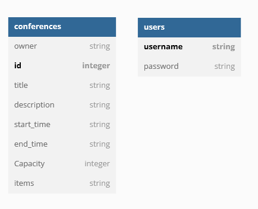

# This is a document for this project

## Database ERD

## API Document

By visiting API Documents u can see the sample requests and responces
you can import the 'API-DOC_for_Insomnia.json' to [insominia](https://insomnia.rest/download) and test the apis
Also u can run progect and visit [http://127.0.0.1:8000/doc](http://127.0.0.1:8000/doc)

## to start the application

1. pip intall -r req.txt
2. uvicorn main:app --reload

# Project Structure. Consistent & predictable
├── folder
│   ├── schemas.py  # pydantic models
│   ├── models.py  # db models
│   ├── main.py 
│   └── test_main.py #tests
